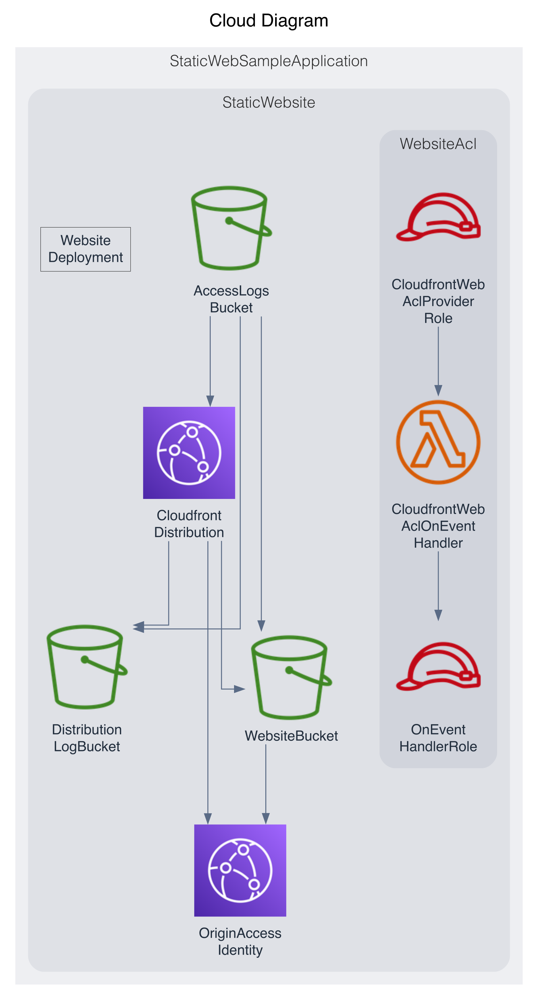

# PDK Static Website Sample

## 준비
- NodeJS (>= 18)
- pnpm
```
npm i -g pnpm
```
- aws-cdk
```
pnpm add -g aws-cdk
```
- cdk bootstrap
```
cd packages/infra
# 다음 명령의 실행을 위해, 리소스를 배포할 AWS 계정의 cli credential 설정을 해야 한다. (ex> aws configure 등의 방법)
cdk bootstrap
```

## packages
- CDK IaC (packages/infra)
- 웹앱 (packages/webapp)
  - NextJs 기반으로 구성

## 배포
```
cd packages/infra
npx cdk deploy StaticWebSampleApplication
```
cloudfront를 통해 정적 웹사이트가 배포되며, deploy 명령어의 실행 결과로 url이 출력된다.
(sample url: https://d2p2rbanhjuwwc.cloudfront.net)

또한, Cloudfront 콘솔을 통해 배포 도메인을 확인할 수 있다.

## Runtime Json Payload
`packages/infra/stacks/application-stack.ts` 에서 다음의 코드를 확인할 수 있다. 
여기서 설정한 jsonPayload는 다음의 경로에서 확인할 수 있다. `/runtime-config.json`
(sample url: https://d2p2rbanhjuwwc.cloudfront.net/runtime-config.json)
```
    const website = new StaticWebsite(this, "StaticWebsite", {
      websiteContentPath: "../webapp/out",
      runtimeOptions: {
        jsonPayload: {
          apiUrl: "your api server url",
        },
      },
    });
```

## Architecture
배포 이후, CDK Graph 플러그인을 통해 아키텍처가 작성된다. (`packages/infra/cdk.out/cdkgraph`)

